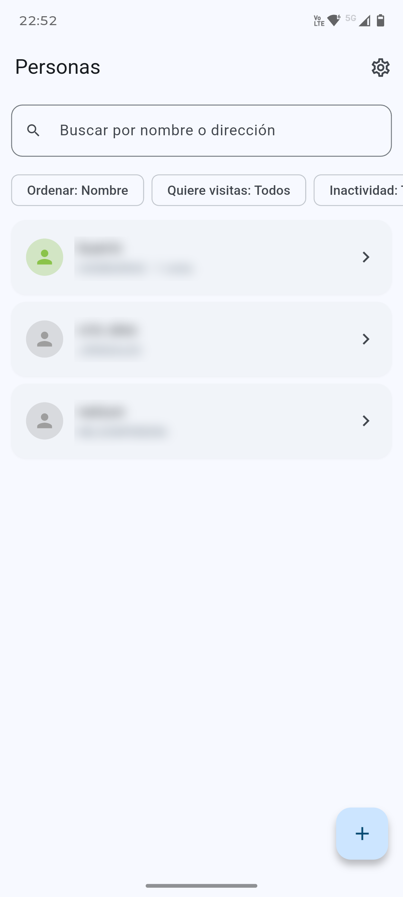
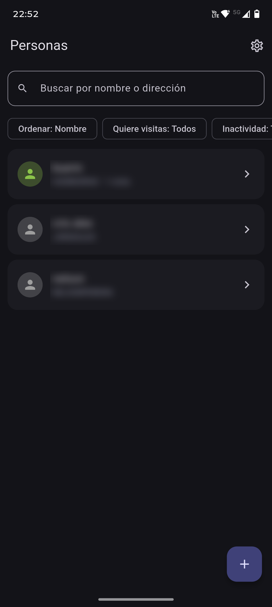
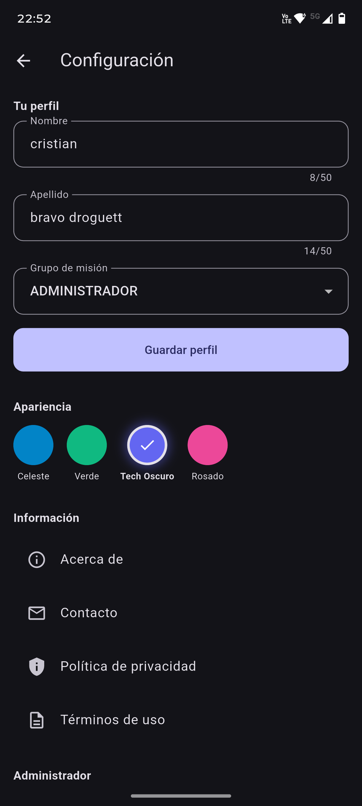

# MisionApp

App para que los misioneros registren personas y visitas, organizados por grupos. Acceso con cuenta Google; datos en Firestore.

**Versión:** 1.0.0

## Qué hace

- Registra **personas y visitas**, con fecha y contenido de cada visita, organizadas por **grupos de misión**.
- Busca por nombre o dirección; ordena por nombre, última visita o complejidad (1–7).
- Filtra quién quiere recibir visitas y quién lleva más de 30 o 60 días sin ellas.
- Para administradores: **estadísticas** y **exportación a Excel**.
- Ingreso con Google, cuatro temas de color (uno oscuro) y, sin internet, muestra los últimos datos guardados.

  
  
  

Ficha con más detalle: [presentacion/misionapp-folleto.pdf](presentacion/misionapp-folleto.pdf).

## Política de Privacidad

[Ver política de privacidad](https://operonte.github.io/releases/misionapp/policies/privacy_policy.html)

## Términos de uso

[Ver términos de uso](https://operonte.github.io/releases/misionapp/policies/terms_of_use.html)

## Descargar APK

**[Descargar última versión para Android (v1.0.0)](https://github.com/operonte/misionapp/releases/latest)**

El APK firmado también está en este repositorio: `release/misionapp-release-1.0.0.apk`

## Repositorio de políticas y enlaces

[operonte/releases](https://github.com/operonte/releases) — políticas, términos y enlaces centralizados para MisionApp, fasT y Horas Médicas.

## Si falla "Entrar con Google" en la app de Play Store

Si la app instalada desde Google Play muestra error al iniciar sesión, suele deberse a que falta el **SHA-1 del certificado de Play** en Firebase. Ver **[docs/FIREBASE_PLAY_SHA1.md](docs/FIREBASE_PLAY_SHA1.md)** para los pasos exactos.

## Desarrollo

- Flutter 3.x
- Firebase (Auth con Google, Firestore)
- Paquete: `com.operonte.misionapp`
